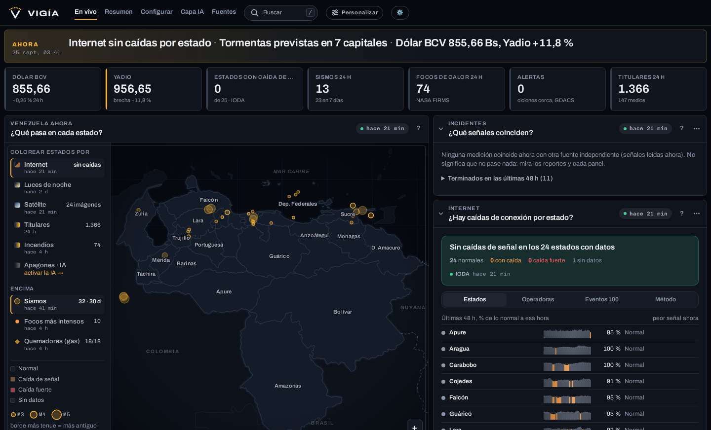
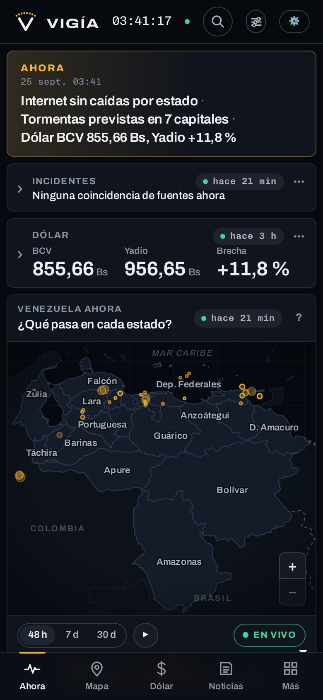
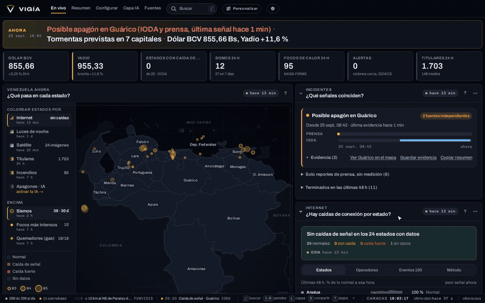
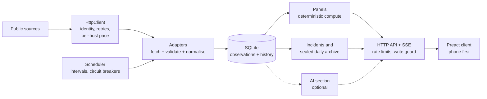

<div align="center">


**Venezuela, en vivo.** A live situation room for Venezuela that you run on your own computer.

[](https://github.com/elberacasa/vigia/actions/workflows/ci.yml)
[](LICENSE)


</div>

Vigía puts what is happening in Venezuela right now on one screen: the dollar (the official rate and named
parallel-market quotes), earthquakes, fires, weather, internet and power outages by state, censorship, airspace
notices, and the news from dozens of Venezuelan and international outlets, on one map, in Spanish first, fast on
a cheap phone. **Every figure shows its source, its licence, and its age.** Nothing is invented, and nothing in the
core is written by an AI.

<p align="center">
  
</p>
<p align="center">
  
</p>
<p align="center">
  
</p>

> **Status: early (0.x).** The core runs today with no keys and no account anywhere. See the
> [changelog](CHANGELOG.md) for what is in each release.

## Contents

- [Features](#features) · [Principles](#principles) · [Quick start](#quick-start) · [Keys](#keys-all-optional)
- [Architecture](#architecture) · [Adapters](#the-adapter-contract) · [Data sources](#data-sources)
- [Roadmap](#roadmap)
- [Contributing](#contributing) · [Licence](#licence)

## Features

- **Money and oil.** The BCV official rate, its history and inflation; parallel-market quotes from named
  publishers, side by side with the official rate and the gap computed in code; oil prices; gas flaring at named
  refineries and fields seen from orbit.
- **Internet and power.** Connectivity by state and by ISP from independent measurement networks, censorship
  measurements with a per-site blocking timeline and a "¿Está bloqueado?" lookup, Tor usage, and night-time lights
  from NASA's Black Marble.
- **Earth.** Earthquakes (USGS and FUNVISIS), fires, weather by state, disasters, tropical storms, and GOES
  satellite imagery on the map.
- **News.** Dozens of outlets, each with its stance labelled, located to a state and municipality by a gazetteer,
  and grouped into stories across outlets.
- **Incidents, not guesses.** An incident opens only when independent sensor families agree within a time window;
  the rule is shown in the UI. Never a probability.
- **Verifiable history.** Every observation is archived. Each day is sealed into a SHA-256 hash chain, and a panel's
  figures can be saved as an evidence bundle that `vigia verify` checks offline
  ([docs/EVIDENCIA.md](docs/EVIDENCIA.md)).
- **Works everywhere.** One file for Windows, macOS and Linux; phone first; light and dark; keyboard accessible;
  `curl localhost:7722` prints the situation as plain text.
- **Optional AI section.** A bundled local classifier (free, offline) with its measured accuracy shown next to it,
  and optional backends that stay within a budget you set ([docs/AI.md](docs/AI.md)).

## Principles

- **Source and age on every figure.** Tap any number to see who published it, when it was valid, when Vigía
  fetched it, its licence, and a link to the original.
- **Stale is labelled stale.** Every source has a freshness budget. The status page (`/estado`) shows each one's
  health; if a source goes down you keep seeing the last good value with its real age, never as live.
- **Numbers are code.** Rates, gaps, counts, baselines and changes are computed by tested, deterministic code,
  never by a model. Models may only classify, cluster and summarise, labelled as AI and linked to their sources.
- **Named quotes, not a house number.** Parallel-market quotes carry the name of whoever published them. Contested
  figures are shown side by side, never blended.
- **Events and places, not people.** No names, faces or handles of private individuals; outages are "signal
  drops" and "reports", not accusations. See [docs/ETHICS.md](docs/ETHICS.md).
- **Your machine, your keys.** No account, no telemetry, no hosted backend. Keys stay on your computer and are only
  ever sent to the service they belong to.

## Quick start

### Download and run (no install)

Download the archive for your system from the [releases page](https://github.com/elberacasa/vigia/releases),
extract it and run `vigia` (sizes for 0.1.0):

| System | Download | Run |
|---|---|---|
| Windows | `vigia-<version>-windows-x64.zip` (44 MB) | "Extract All", then double-click `vigia.exe` |
| macOS | `vigia-<version>-darwin-arm64.tar.xz` (Apple silicon, 20 MB) or `-darwin-x64.tar.xz` (Intel, 24 MB) | `tar -xf vigia-*-darwin-*.tar.xz && ./vigia-*-darwin-*/vigia` |
| Linux | `vigia-<version>-linux-x64.tar.xz` (31 MB) or `-linux-arm64.tar.xz` (29 MB) | `tar -xf vigia-*-linux-*.tar.xz && ./vigia-*-linux-*/vigia` |

Uncompressed single files (73 to 97 MB) are published too.
The files are not signed yet: macOS asks you to allow it once (System Settings → Privacy & Security → "Open
Anyway"), and Windows SmartScreen asks too ("More info" → "Run anyway"). Each release publishes `SHA256SUMS`;
[docs/SETUP.md](docs/SETUP.md) shows how to check your download.

Vigía opens `http://localhost:7722`. With no keys at all, earthquakes, news, rates, connectivity and weather start
filling in within a minute or two.

**Have an AI coding agent?** Paste the prompt in [docs/AGENT-SETUP.md](docs/AGENT-SETUP.md) into it (Claude Code or
any agent that runs terminal commands): it downloads the right archive, checks it against `SHA256SUMS`, runs it and
opens the settings link, and never asks for your keys in the chat (they go in `/guia`).

### From source

With [Bun](https://bun.sh) 1.4 or newer, on Linux, macOS or Windows:

```sh
git clone https://github.com/elberacasa/vigia.git
cd vigia
bun install
bun run build:web
bun start
```

### Command line

```
vigia --port 8080        another port
vigia --host 0.0.0.0     let phones on your network open it (settings stay changeable only from this computer)
vigia sources            list every source and whether it needs a key
vigia fetch usgs-quakes  query one source once and print what came back
vigia status             print the current situation from a running Vigía
vigia verify             check that the sealed archive has not changed
vigia paths              where settings, keys and data are stored
vigia enlace             print and open again the link that lets this browser change settings
vigia telegram add @name add a public Telegram channel to "Mis fuentes" (also in Personalizar › Mis fuentes)
vigia ia conectar        let your own Claude Code write the daily brief (vigia ia estado, vigia ia desconectar)
vigia --version          print the version
```

The full guide, including data locations, other devices and troubleshooting, is
[docs/SETUP.md](docs/SETUP.md).

## Keys (all optional)

Vigía works with **no keys and no payment method**. The setup guide at `/guia` explains each optional key, links to
its sign-up page, and checks it live before saving it on your machine.

| Key | Cost | Adds |
|---|---|---|
| NASA FIRMS | free, no card | fire detections queried for Venezuela only (far less data than the keyless file) |
| DAHITI | free, no card (non-commercial use) | the Guri reservoir level from satellite altimetry |
| TypeSafe (Jev) | paid per use, within your budget | the most accurate news classification in the AI section |
| Anthropic | paid per use, within your budget | a written daily brief with checked citations, on request |

Paid keys only act within a budget you set; with no budget, Vigía makes no paid request.

## Architecture

One Bun process polls public sources through adapters, stores every observation in SQLite with its history,
computes each panel in tested code, and serves a small Preact client over HTTP and server-sent events.



The core never depends on the AI section. Details, including the security model, are in
[docs/ARCHITECTURE.md](docs/ARCHITECTURE.md); performance is measured in [docs/PERF.md](docs/PERF.md).

| Path | What |
|---|---|
| `src/adapters/` | one directory per source, plus the registry |
| `src/core/` | adapter contract, HTTP client, scheduler, breakers, store, health |
| `src/panels/` | deterministic computation behind each panel |
| `src/intel/` | incidents, sealed archive, evidence bundles, terminal output |
| `src/server/` | HTTP API, live stream, static client |
| `src/ai/` | optional AI section: interfaces, local model, ledgered clients |
| `web/` | the Preact client |
| `scripts/` | builds, fixtures, performance, generated docs |

## The adapter contract

Every feed is an adapter with the same contract (`src/core/types.ts`):

- **`fetch(ctx)`**: network only, through the shared HTTP client (identity, timeouts, retries with backoff, the
  source's rate limit). Keys come from the key store and never appear in logs or links.
- **`normalise(raw)`**: pure. Validates the response at the boundary (Zod) and returns typed observations
  `{ source, series, sourceUrl, observedAt, fetchedAt, licence, value, location?, confidence, basis }`. A bad
  envelope fails the run loudly; the last good value stays on screen with its age.
- **Declared, not implied**: licence and attribution, keys, polling interval, and a freshness budget that drives the
  stale badge and the status page.
- **Tested** against recorded fixtures (the real bytes a source sent) or, where the source's terms forbid
  redistributing them, synthetic ones.

### Adding a source

1. Read the source's terms and rate limits.
2. Create `src/adapters/<id>/index.ts` implementing `Adapter`, and register it in `src/adapters/registry.ts`.
3. Record a fixture with `bun scripts/record-fixture.ts <id>` and write the tests.
4. Run `bun scripts/gen-docs.ts` to update the source catalogue, then `bun run check`.

The step-by-step guide and checklist are in [docs/ADAPTERS.md](docs/ADAPTERS.md).

## Data sources

<!-- sources:start (generated by bun scripts/gen-docs.ts) -->
Vigía reads **313 sources**; **309** of them work with no key at all. The full catalogue,
with publisher, refresh interval, access and licence for each, is generated from the adapter registry into
[docs/DATA-SOURCES.md](docs/DATA-SOURCES.md).

| Layer | Sources | Publishers |
|---|---|---|
| Money and prices | 13 | Banco Central de Venezuela, BCV (vía bcv-api), Yadio, Binance, Bybit, U.S. EIA y Reserva Federal vía FRED, and 5 more |
| Oil and energy | 2 | U.S. EIA vía FRED, NASA FIRMS |
| Internet and power | 12 | IODA, Georgia Tech Internet Intelligence Lab, RIPE NCC, RIPE NCC (RIPEstat), RIPE NCC (RIPEstat, RIS), NASA GIBS / Black Marble, OONI, and 3 more |
| Earth and weather | 8 | USGS, FUNVISIS, NOAA/NESDIS/STAR, Open-Meteo, NASA FIRMS, GDACS (ONU / CE JRC), and 2 more |
| Society and attention | 10 | EASA, FAA, Imprenta Nacional (Gaceta Oficial), Wikimedia, Ministerio del Poder Popular para la Salud, Organización Mundial de la Salud (GHO), and 4 more |
| News | 268 | YouTube (páginas públicas de cada canal), medido por Vigía, Emisoras (sus propios servidores), medido por Vigía, 2001online, Alba Ciudad, Analítica, Aporrea, and 220 more |
<!-- sources:end -->

Data belongs to its publishers under their own terms, shown with every figure and on the sources page
(`/fuentes`). Sources whose terms do not allow redistribution are only used for figures Vigía derives from them,
with attribution. Bundled data and libraries are listed in [NOTICE](NOTICE).

## Roadmap

- **Laya:** today the optional AI news layer uses Jev (TypeSafe) with your own key, plus an experimental local model.
  If Vigía finds enough users to maintain and develop it, the plan is to train Laya, a model of our own that is
  free for everyone and runs offline.
- Ideas are proposed and voted in [Discussions › Ideas](https://github.com/elberacasa/vigia/discussions/categories/ideas);
  the most-voted get built first.

## Contributing

Contributions are welcome: new sources, fixes to broken feeds, translations, performance, accessibility. Start with
[CONTRIBUTING.md](CONTRIBUTING.md); the one command that must pass is `bun run check`. Please report security issues
privately ([SECURITY.md](SECURITY.md)), and follow the [Code of Conduct](CODE_OF_CONDUCT.md).

**Contact:** questions and ideas in [GitHub Discussions](https://github.com/elberacasa/vigia/discussions), bugs and
broken feeds in [issues](https://github.com/elberacasa/vigia/issues), or the maintainer on X,
[@elberacasa](https://x.com/elberacasa). Security reports stay private (SECURITY.md).

## Licence

Copyright © 2026 [elberacasa](https://github.com/elberacasa).

Vigía is **source-available, not open source**: it is licensed under the
[PolyForm Noncommercial License 1.0.0](LICENSE). In plain words:

- You **may** read, run, modify and share it for any **non-commercial** purpose: personal study, research and
  hobby projects, and use by charities, schools, public research, public safety and health organisations, and
  government institutions.
- You **may not** sell it, sell access to it, or use it in a commercial product or paid service. Commercial use
  needs a separate licence from the copyright holder.
- If you share it, pass on the licence and its `Required Notice` line.

This summary is not the licence; [LICENSE](LICENSE) is. Third-party libraries, bundled data and fonts keep their
own licences ([NOTICE](NOTICE)), and data fetched at run time belongs to its publishers.
