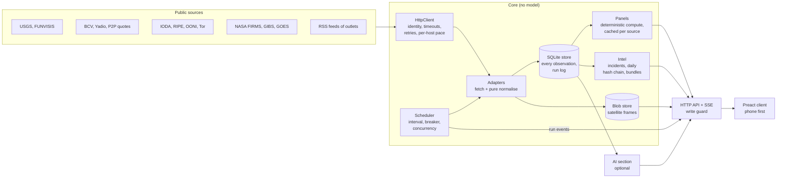

# Architecture

Vigía is one process: a Bun server that polls public sources, keeps every observation in SQLite, computes each
panel in tested code, and serves a small Preact client. It runs on a laptop, needs no keys to be useful, and has
no hosted backend.

## Two parts: the core and the optional AI section

**The core is a complete situation room without any model.** Every panel is deterministic code over public
sources: fetch, validate, normalise, store, compute, render.

- News is grouped by outlet and time, located by a gazetteer (every state, municipality, city and well-known
  sector, with accents and common variants) plus tested keyword rules, and grouped into stories by title
  similarity. The UI labels this honestly: "ubicación por palabra clave" (location by keyword).
- Figures, gaps, counts, baselines and changes are arithmetic in code, with tests. For example, "connectivity in
  Zulia is 38 % below its 7-day baseline" comes from `src/panels/connectivity.ts`, never from a model.
- Incidents (below) are rules anyone can read in the UI behind "?"; the text is generated from the same constants
  the code uses.

**The AI section ("Capa IA") is optional** and clearly separated. Each feature names the model that produced it,
can be switched off, and shows its measured accuracy next to it. Backends, cheapest first: the bundled local model
(free, offline), a local LLM through Ollama, the user's own Claude Code, Jev (TypeSafe) with the user's key, and the
Anthropic API with the user's key. Rules: models never produce numbers, every AI output shows its model and its
sources, and the core never depends on the AI section. See [AI.md](AI.md).

## Data flow



1. **Adapters** (`src/adapters/<id>/`) know one source each. `fetch` does network only, through the shared
   `HttpClient`; `normalise` is a pure function that validates the raw response with Zod and returns typed
   observations with source, link, observed time, fetch time, licence, basis and confidence. See
   [ADAPTERS.md](ADAPTERS.md).
2. **The scheduler** (`src/core/scheduler.ts`) runs each enabled adapter on its interval, with jitter and at most
   six feeds fetching at once. Each feed has its own **circuit breaker** (`src/core/breaker.ts`): after repeated
   failures it stops calling the source and backs off, doubling the cooldown up to a cap. A failing
   feed never affects another; its last good value keeps being served with its real age.
3. **The store** (`src/core/store.ts`, SQLite) keeps history from day one: every distinct observation is a row. An
   identical re-fetch is ignored; a revision (for example USGS updating a magnitude) is a new row. The run log
   records every attempt, which feeds the health model. Images (satellite frames, night-lights mosaics) go to a
   content-addressed **blob store** (`src/core/blobs.ts`) and are served from Vigía's own origin, so the browser
   never contacts a third party.
4. **Health and freshness** (`src/core/health.ts`): each adapter declares a freshness budget (how old its last
   successful fetch and its newest datum may be). Every feed is `ok`, `stale`,
   `degraded`, `failing`, `locked` (needs a key), `off` or `pending`; the status page (`/estado`) lists them all,
   and every figure in the UI shows its age.
5. **Panels** (`src/panels/`, registered in `src/server/panel-registry.ts`) turn stored observations into the view
   model one UI panel renders. All arithmetic happens here; the browser only formats. `PanelCache`
   (`src/server/panels.ts`) keeps each panel until one of its sources inserts new data; a panel that throws serves
   its last good value, marked as such.
6. **Intel** (`src/intel/`):
   - *Incidents* fuse signals from independent source families (IODA, RIPE Atlas, NASA VIIRS, USGS, FUNVISIS, the
     press) that agree about one place and one kind of event within a time window. The only strength shown is how
     many independent families agree; no probability is invented.
   - *Sealed archive*: each UTC day of received observations is hashed into a Merkle tree whose root is chained to
     the previous day's digest. *Evidence bundles* carry observations with their Merkle proofs; `vigia verify`
     checks them offline. See [EVIDENCIA.md](EVIDENCIA.md).
   - *Terminal report*: `curl localhost:7722` (or `/ahora.txt`) prints the situation as plain text, built from the
     same panel views as the web page.
7. **The server** (`src/server/app.ts`) exposes a small JSON API (`/api/panels`, `/api/health`,
   `/api/feeds/<id>/latest`, `/api/feeds/<id>/series/<series>`, `/api/incidents`, `/api/evidence`,
   `/api/archive/digests`, `/api/blobs/…`), a server-sent event stream (`/api/stream`) that tells clients which
   panels changed, and the built client. JSON responses are gzipped, every API request is
   rate-limited per client, and strict security headers (CSP, COOP, CORP) are set.
8. **The client** (`web/`) is Preact with signals, no map library: the map is precomputed SVG paths
   (`scripts/build-map.ts`). Secondary pages load on demand; a service worker keeps the shell and last-known data
   for repeat visits and offline use. See [PERF.md](PERF.md) for measured sizes and timings.

## Security model

Vigía is a local tool, so its threats are other web pages in the same browser, other devices on the network, and
reverse proxies. Details in [SECURITY.md](../SECURITY.md).

- **Reads are open**, writes are not. Every mutating endpoint (adding or removing a key, AI settings, turning a feed
  on or off, asking for a written brief) requires a loopback `Host`, a matching `Origin`, a JSON body, a rate-limit
  token, and the **session cookie**.
- **Session token** (`src/config/session.ts`): a random token stored in a `0600` file next to the keys, printed by
  the CLI inside the URL it opens, and exchanged for an `HttpOnly`, `SameSite=Strict` cookie. It closes the gap
  that loopback and Origin checks leave open when a reverse proxy on the same machine relays requests.
- **LAN mode** (`--host 0.0.0.0`): any device on the network may read; writes still need a loopback Host.
- **Keys** (`src/config/keys.ts`) live in `keys.json` (mode 600 where the OS supports it) or in environment
  variables. The browser only ever learns "set / not set"; keys are never logged and are only sent to the provider
  they belong to.
- **Licences are enforced**: sources whose terms forbid redistribution declare `raw: false`, and the raw feed
  endpoints refuse their rows (panels still show what Vigía derives from them).
- **Paid requests** all go through one ledger (`src/ai/ledger.ts`) with a hard, user-set budget checked before each
  request; a budget of 0 blocks every paid call.

## Directory map

```
src/
  cli.ts            entry point: serve, fetch, sources, paths, verify, status
  adapters/         one directory per source; registry.ts lists them all
  core/             adapter contract (types.ts), HTTP client, scheduler, breaker, health, store, blobs, fixtures
  panels/           one module per panel: stored observations → view model (all the arithmetic)
  server/           HTTP API, panel cache and registry, history replay, rate limiter, static files
  intel/            incidents, daily hash chain, evidence bundles, terminal report
  news/             headline normalisation, topics, keyword place tagger, story clustering
  geo/              point-in-polygon for states and municipalities, gazetteer, boundaries (data/)
  imaging/          the shared geographic frame for satellite images, sun position, JPEG handling
  formats/          small parsers: xlsx, xls, zip, time helpers
  sources/          key specs (what each key unlocks, how to get it, how it is validated), shared licences
  config/           per-OS paths, key store, settings, session token
  ai/               optional AI section: judge interfaces, Jev client, ledger, local model, brief writer
web/
  index.html        static boot shell (skeleton of the page, first paint before any script)
  src/              Preact app: panels/, pages/ (status, sources, guide, AI, brief), map/, ui/, lib/, styles/
  static/           fonts, icons, manifest, service worker
  assets/brand/     logo and icons (SVG)
scripts/
  build-web.ts      builds the client into web/dist
  build-bin.ts      single-file executables for Linux, macOS and Windows
  build-map.ts      precomputes the map's SVG paths
  build-places.ts   names-only place index for the command palette
  record-fixture.ts records an adapter's real responses as a test fixture
  perf.ts           measures load on a throttled slow-phone profile
  shoot.ts          screenshots at phone, desk and wall sizes
  ai/               training and evaluation of the bundled local model
```

## Design choices worth knowing

- **Bun + SQLite, no external services.** One binary, no database server, no Docker requirement.
- **No map library.** Venezuela's states and municipalities are precomputed SVG paths; overlays are stretched to one
  shared geographic frame (`src/imaging/frame.ts`), so the first load stays small on a slow connection.
- **Numbers are code.** Anything the UI shows as a figure is computed deterministically and tested; models only
  classify, cluster and summarise, always with links to their sources.
- **Honest time.** Every observation carries when the source says it is true (`observedAt`) and when Vigía received
  it (`fetchedAt`). The UI shows age, and a stale badge when a feed misses its budget.
